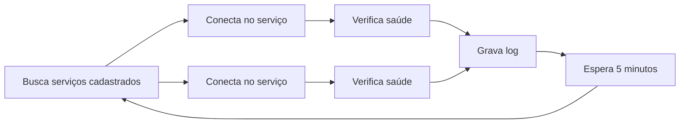

# Redes de Petri

## Introdução

Redes de Petri são uma ferramenta matemática para modelar sistemas concorrentes e distribuídos. Elas são uma extensão dos autômatos finitos e das máquinas de estados finitos. Redes de Petri são uma forma gráfica de representar sistemas concorrentes e distribuídos, e são úteis para modelar sistemas que possuem múltiplos estados e múltiplas transições.

## Aplicação proposta

A proposta é modelar um sistema de verificação de saúde de aplicações.

### Requisitos Funcionais

#### RF01 - O sistema deve permitir a verificação de saúde de várias aplicações.
#### RF02 - O sistema deve permitir a verificação concorrente de várias aplicações.
#### RF03 - O sistema deve verificar a saúde de uma aplicação em intervalos de tempo regulares.
#### RF04 - O sistema deve gravar o resultado da verificação de saúde de uma aplicação.
#### RF05 - O sistema deve permitir a visualização do resultado da verificação de saúde de uma aplicação.

### Regras de Negócio

#### RN01 - O sistema deve verificar a saúde de uma aplicação a cada 5 minutos.
#### RN02 - O sistema deve gravar o resultado da verificação de saúde de uma aplicação em um arquivo de log.
#### RN03 - O sistema deve permitir a visualização do resultado da verificação de saúde de uma aplicação em um arquivo de log.

## Diagramas

### Maquina de Estados

#### Verificar serviços cadastrados

